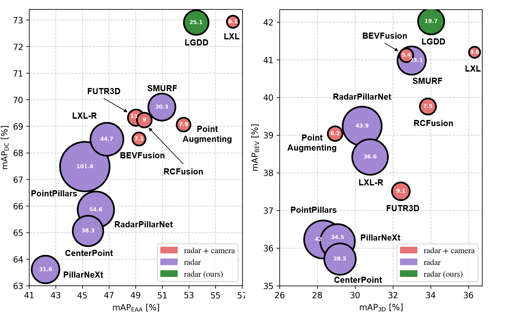

# LGDD: Local-Global Synergistic Dual-Branch 3D Object Detection Using 4D Radar

## 🗓️ News

- **2025.03.01** Code v1.0 released
- **2025.02.28** Submit to IROS 2025

<video width="1000" height="480" controls> <source src="docs/all_Figures/LGDD-demo.mp4" type="video/mp4">Your browser does not support the video tag.</video>

## 📜 Abstract
 
4D millimeter-wave radar plays a pivotal role in autonomous driving due to its cost-effectiveness and robustness in adverse weather. However, the application of 4D radar point cloud in 3D perception tasks is hindered by its inherent sparsity and noise. To address these challenges, we propose LGDD, a novel local-global synergistic dual-branch 3D object detection framework using 4D radar. Specifically, we first introduce a point-based branch, which utilize a voxel-attended point feature extractor (VPE) to integrate semantic segmentation with cluster voting, thereby mitigating radar noise and extracting local-clustered instances features. Then, for the conventional pillar-based branch, we design a query-based feature pre-fusion (QFP) to address the sparsity and enhance global context representation. Additionally, we devise a proposal mask to filter out noisy points, enabling more focused clustering on regions of interest. Finally, we align the local instances with global context through semantics-geometry aware fusion (SGF) module to achieve comprehensive scene understanding. Extensive experiments demonstrate that LGDD achieves state-of-the-art performance on the public View-of-Delft and TJ4DRadSet datasets.

Performance-latency comparison on the View-of-Delft (left) and TJ4DRadaSet (right) datasets, respectively. The frames per second (FPS) are represented by the diameter of the blobs.
## 🛠️ Method

Overall architecture of our LGDD. (a) The pillar-based branch first pillarizes the 4D radar and extracts sparse pillars using RadarPillarNet \cite{RCFusion}. Then QFP aggregates the sparse point-wise features, with the updated pillars being passed into the 2D backbone for global context generation. (b) The point-based branch utilizes a sparse voxel feature extractor to facilitate feature extraction and obtain point-wise features via VPE. Then, semantic segmentation is integrated with cluster voting \cite{VoteNet} to generate local instances features. (c) In the fusion and detection stage, the SGF aligns features from both branches to achieve comprehensive scene understanding.

## 🍁 Quantitative Results

## 🔥 Getting Started

step 1. Refer to [Install.md](./docs/Guidance/Install.md) to install the environment.

step 2. Refer to [dataset.md](./docs/Guidance/dataset.md) to prepare View-of-delft (VoD) and TJ4DRadSet (TJ4D) datasets.

step 3. Refer to [train_and_eval.md](./docs/Guidance/train_and_eval.md) for training and evaluation.

## 🚀 Model Zoo

We retrained the model and achieved better performance compared to the results reported in the tables of the paper. We provide the checkpoints on View-of-delft (VoD) and TJ4DRadSet datasets, reproduced with the released codebase.

| Datasets                                                                    | Metric 1       | Metric2       | Details       |
| :-------------------------------------------------------------------------: | :------------: | :-----------: | :-----------: |
| **VoD**                                                                     | **EAA 3D mAP** | **DC 3D mAP** | **Weights**   |
| [Baseline](projects/RadarPillarNet/configs/VoD-radarpillarnet_4x1_80e.py)   |    46.01       |   65.86       | [Link](https://github.com/shawnnnkb/LGDD/releases/download/weights-and-checkpoints/final_ckpt.zip)|   
| [LGDD](projects/LGDD/configs/vod-LGDD_2x4_24e.py)                           |    53.49       |   72.20       | [Link](https://github.com/shawnnnkb/LGDD/releases/download/weights-and-checkpoints/final_ckpt.zip)| 
| **TJ4D**                                                                    | **EAA 3D mAP** | **DC 3D mAP** | **Weights**   |
| [Baseline](projects/RadarPillarNet/configs/TJ4D-radarpillarnet_4x4_20e.py)  |    30.37       |   39.24       | [Link](https://github.com/shawnnnkb/LGDD/releases/download/weights-and-checkpoints/final_ckpt.zip)|           
| [LGDD](projects/LGDD/configs/TJ4D-LGDD_2x4_24e.py)                          |    34.02       |   42.02       | [Link](https://github.com/shawnnnkb/LGDD/releases/download/weights-and-checkpoints/final_ckpt.zip)|

## 🐸 Visualization Results

Figures (a), (b), and (c) show some visualization results on the VoD \cite{VoD} validation set, while (d), (e), and (f) show results on the TJ4DRadSet \cite{TJ4DRadSet} test set. Orange and yellow boxes represent ground truths in the perspective and bird's-eye views, respectively, while blue and green boxes indicate predicted bounding boxes in the corresponding views. The first and second figures compare the baseline with our LGDD \cite{RCFusion}, while the third visualizes LGDD's detection on the image plane. Attention is drawn to the purple region, which delineates areas of false positives, false negatives, or imprecise bounding box in the baseline. Better zoom in for details.

### 😙 Acknowledgement

Many thanks to these exceptional open source projects:
- [BEVFormer](https://github.com/fundamentalvision/BEVFormer)
- [DFA3D](https://github.com/IDEA-Research/3D-deformable-attention.git)
- [mmdet3d](https://github.com/open-mmlab/mmdetection3d)
- [VoxFormer](https://github.com/NVlabs/VoxFormer.git)
- [OccFormer](https://github.com/zhangyp15/OccFormer.git)
- [CGFormer](https://github.com/pkqbajng/CGFormer)
- [SGDet3D](https://github.com/shawnnnkb/SGDet3D)
- [SST](https://github.com/TuSimple/SST)

As it is not possible to list all the projects of the reference papers. If you find we leave out your repo, please contact us and we'll update the lists.

## ✒️ Citation

If you find our work beneficial for your research, please consider citing our paper and give us a star. If you encounter any issues, please contact shawnnnkb@zju.edu.cn. Here is my [page](shawnnnkb.github.io). 
